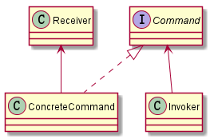
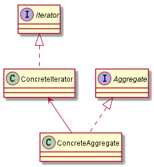
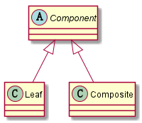
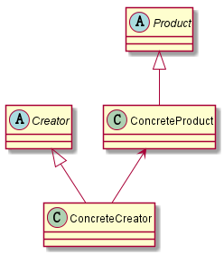
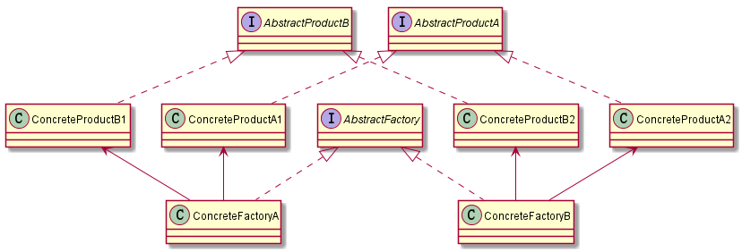
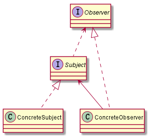
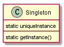
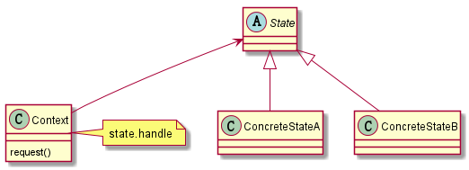

## 适配器模式
包装一个对象，来提供不同的接口  [源码例子](src/adapter)

## 代理模式
包装一个对象，来控制对它的访问

## 外观模式
包装多个对象，以简化它们的接口 [源码例子](src/facade)

## 装饰者模式
包装另一个对象，并提供额外的行为 [源码例子](src/decorator)

## 命令模式
把请求封装成对象，这可以让你使用不同的请求、队列或日志请求来参数化其他对象 [源码例子](src/command)

## 迭代器模式
提供一种方法顺序访问一个聚合对象中的各个元素，而又不暴露其内部的表示 [源码例子](src/iterator)

## 组合模式
允许你将对象组合成树形结构来表现“整体/部分”的层次结构 [源码例子](src/component)

## 工厂模式
定义了一个创建对象的接口，但由子类决定要实例化的类是哪一个 [源码例子](src/factory)

## 抽象工厂模式
提供一个接口，用于创建相关或依赖对象的家族，而不需要明确指定具体类 [源码例子](src/factory/abstra)

## 观察者模式
定义了对象之间一对多依赖，当一个对象改变状态时，它的所有依赖者都会收到通知并自动更新 [源码例子](src/observer)

## 单例模式
确保一个类只有一个实例，并提供一个全局访问点 [源码例子](src/singleton)

*Note that：单例模式分为饿汉式、懒汉式、Double CheckLock*

## 状态模式
允许对象在内部状态改变时改变它的行为，对象看起来好像修改了它的类 [源码例子](src/state)

## 策略模式
定义了算法族，分别封装起来，让它们之间可以互相代替，让算法的变化独立于使用算法的客户 [源码例子](src/strategy)

## 模板模式
在一个方法中定义一个算法的骨架，而将一些步骤延伸到子类中，使得子类在不改变算法结构的情况下，重新定义算法中的某些步骤 [源码例子](src/template)