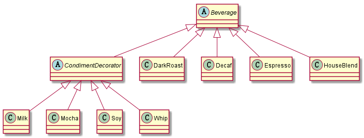

## 1、适配器模式
包装一个对象，来提供不同的接口  [源码例子](src/adapter)


## 2、代理模式
代理对象持有被代理对象的引用，通过代理对象简介访问被代理对象，来控制对被代理对象的访问（重点学习动态代理涉及反射知识） [源码例子](src/proxy)

动态代理弥补了普通代理删除或增加接口方法需要改动多个类的不足，动态代理无论接口方法怎么变化都不受影响


定义一个接口

```java
public interface IProgrammer {
       void developApp();
       void developWebSite();
       void developServer();
}
```

真实的对象实现接口的方法

```java
public class RealSubject implements IProgrammer {

	@Override
	public void developApp() {
		System.out.println("客户需要开发一个包含Android客户端、iPhone客户端的APP");

	}

	@Override
	public void developWebSite() {
		System.out.println("客户需要开发一个PC端网站");

	}

	@Override
	public void developServer() {
		System.out.println("客户需要开发一个服务于APP和PC网站的后台");

	}

}

```

假的对象调用真实对象的方法

```java
public class ProgramTestDrive {

	/**
	 * @param args
	 */
	public static void main(String[] args) {
		//被代理类
		RealSubject realSubject = new RealSubject();
		
		Class<?> clazz = realSubject.getClass();
		ClassLoader loader = clazz.getClassLoader();
		
		OwnerInvocationHandler handler = new OwnerInvocationHandler(realSubject);
		IProgrammer iProgrammer = new ProxySubject().getOwnerProxy(loader,
				new Class[] { IProgrammer.class }, handler);
		
		iProgrammer.developApp();
		iProgrammer.developWebSite();
		iProgrammer.developWebSite();
	}

}
```

```java
public class ProxySubject {
    
	/**
	 * 返回一个代理类
	 * @param loader
	 * @param clazz
	 * @param handler
	 * @return
	 */
	public IProgrammer getOwerProxy(ClassLoader loader, Class<?> clazz[],
			InvocationHandler handler) {
		return (IProgrammer) Proxy.newProxyInstance(loader, clazz, handler);
	}
}
```

动态代理模式简化的样子

```java
//被代理的类
IProgrammer realSubject=new RealSubject();

//代理类
IProgrammer proxySubject=Proxy.newProxyInstance(classLoader,new Class[]{IProgrammer.class},new InvocationHandler());

//使用代理类访问接口提供的方法，用户只和代理类交互，起到保护被代理类的目的
proxySubject.developApp();
proxySubject.developWebSite();
proxySubject.developWebSite();
```


`Proxy`属于`java.lang.reflect`反射包下的类，传入一个真实对象的ClassLoader，真实对象实现的接口和`java.lang.reflect`包下InvocationHandler的一个子类，得到一个代理的对象，代理对象实现真实对象一样的接口，所以可以调用真实对象实现的接口方法


## 3、外观模式
包装多个对象，以简化它们的接口 [源码例子](src/facade)


## 4、装饰者模式
包装另一个对象，并提供额外的行为


例子源码相关类，绘制装饰者UML图 [源码例子](src/decorator)




## 5、命令模式
把请求封装成对象，这可以让你使用不同的请求、队列或日志请求来参数化其他对象 [源码例子](src/command)


## 6、迭代器模式
提供一种方法顺序访问一个聚合对象中的各个元素，而又不暴露其内部的表示 [源码例子](src/iterator)


## 7、组合模式
允许你将对象组合成树形结构来表现“整体/部分”的层次结构 [源码例子](src/component)


## 8、工厂模式
定义了一个创建对象的接口，但由子类决定要实例化的类是哪一个 [源码例子](src/factory)


## 9、抽象工厂模式
提供一个接口，用于创建相关或依赖对象的家族，而不需要明确指定具体类 [源码例子](src/factory/abstra)


## 10、观察者模式
定义了对象之间一对多依赖，当一个对象改变状态时，它的所有依赖者都会收到通知并自动更新 [源码例子](src/observer)


## 11、单例模式
确保一个类只有一个实例，并提供一个全局访问点 [源码例子](src/singleton)


*Note that：单例模式分为饿汉式、懒汉式、Double CheckLock*


## 12、状态模式
允许对象在内部状态改变时改变它的行为，对象看起来好像修改了它的类 [源码例子](src/state)


## 13、策略模式
定义了算法族，分别封装起来，让它们之间可以互相代替，让算法的变化独立于使用算法的客户 [源码例子](src/strategy)


## 14、模板方法模式
在一个方法中定义一个算法的骨架，而将一些步骤延伸到子类中，使得子类在不改变算法结构的情况下，重新定义算法中的某些步骤 [源码例子](src/template)